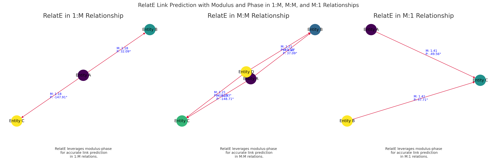

# RelatE: Relational Embeddings through Modulus-Phase Decomposition

### Introduction
This is a PyTorch implementation of RelatE for learning embeddings in knowledge graphs (KGE). RelatE introduces enhancements that improve handling of complex relations (one-to-many, many-to-one, many-to-many) in knowledge graphs. The implementation is optimized for fast training on large-scale knowledge graphs and can achieve state-of-the-art performance on datasets like FB15K, WN18, and YAGO3-10.

### Implemented Features
- ✔ Supports Diverse Relational Patterns
- ✔ Enhanced Relation Expressiveness
- ✔ Improved Scoring Mechanism
- ✔ Efficient Training & Inference


### Evaluation Metrics
We evaluate RelatE using the following standard KGE metrics:
- Mean Rank (MR): Measures the average rank of correct entities.
- Hits@10 (Filtered): Percentage of test triples where the correct entity is ranked in the top 10 after filtering out corrupted triples.

### Loss Function:
- Uniform Negative Sampling
- Self-Adversarial Negative Sampling

### Supported Datasets
| Dataset   | #R   | #E    | # (Train / Valid / Test)          |
|-----------|------|-------|-----------------------------------|
| FB15K     | 1,345|14,951 | 483,142 / 50,000 / 59,071         |
| FB15K-237 | 237  |14,541 | 272,115 / 17,535 / 20,466         |
| WN18      | 18   |40,943 | 141,442 / 5,000 / 5,000           |
| WN18RR    | 11   |40,943 | 86,835 / 3,034 / 3,134            |

### Usage

Knowledge Graph Data Format:

The dataset consists of the following files:

- entities.dict – A dictionary mapping entities to unique IDs

- relations.dict – A dictionary mapping relations to unique IDs

- train.txt – The dataset used to train the KGE model

- valid.txt – The validation dataset 

- test.txt – The dataset used to evaluate the KGE model
### Testing
```plaintext
bash run.sh train RelatE dataset_name GPU_device_number save_id batch_size negative_sample_size hidden_dim gamma adversarial_temperature learning_rate  number_of_steps 16
```
To change the modulus and phase weights, locate the model.py file in the Code folder. Change the multiplying factors associated with modulus_score and phase_score.
### Testing
```plaintext
python run.py --do_test --data_path ./data/FB15K --init_checkpoint ./output/RelatE_FB15K --test_batch_size 16 --cuda
```
### Hyperparameters
| Dataset | Negative sample size n  | Hidden_dim d | Margin g | -a Adversial Temp | Batch_Size | mw | pw | Learning rate | Steps |Regularization|
|-------------|-------------|-------------|-------------|-------------|-------------|-------------|-------------|-------------|-------------|--------|
| FB15k | 256 | 1000 | 12 | 1 | 1024 | 4 | 1.5 | 0.0001 | 100k |0|
| WN18  | 512 | 250 | 6 | 1 | 1024 | 3.5 | 1.5 | 0.0005 | 80k |0.00001|
| FB15k-237  | 1000 | 256 | 12 | 1 | 1024 | 3.5 | 1 | 0.00005 | 120k |0|
| WN18RR  | 512 | 250 | 4 | 1 | 512 | 3.5 | 1.5 | 0.0005 | 100k |0.00001|
| YAGO3-10   | 512 | 2500 | 6 | 2 | 1024 | 5.5 | 2.5 | 0.0005 | 80k |0|

### Results of RelatE model
| Dataset | FB15k | FB15k-237 | WN18 | WN18RR | YAGO3-10 |
|-------------|-------------|-------------|-------------|-------------|-------------|
| MR | 51.9 | 193 | 162.6 | 1943 | 886 |
| HITS@10 | .845 | .544 | .955 | .551 | .59 |

## Acknowledgement
We refer to the code of [RotatE](https://github.com/DeepGraphLearning/KnowledgeGraphEmbedding). Thanks for their contributions.

