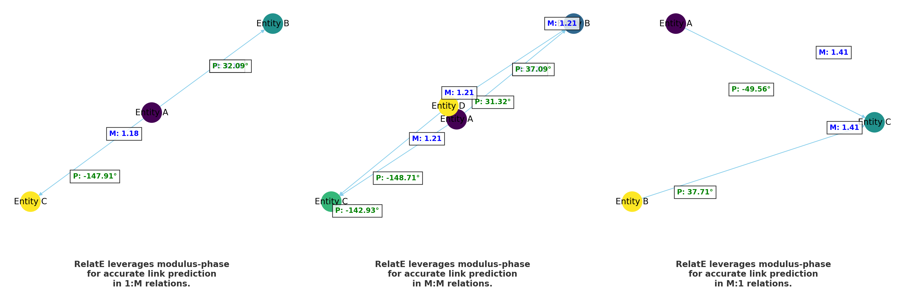

# RelatE: Relational Embeddings through Modulus-Phase Decomposition

### Introduction
This is a PyTorch implementation of RelatE for learning embeddings in knowledge graphs (KGE). RelatE introduces enhancements that improve the handling of complex relations (one-to-many, many-to-one, many-to-many) in knowledge graphs. The implementation is optimized for fast training on large-scale knowledge graphs and can achieve state-of-the-art performance on datasets like FB15K, WN18, and YAGO3-10.

### Implemented Features
- ✔ Supports Diverse Relational Patterns
- ✔ Enhanced Relation Expressiveness
- ✔ Improved Scoring Mechanism
- ✔ Efficient Training & Inference


### Evaluation Metrics
We evaluate RelatE using the following standard KGE metrics:
- Mean Rank (MR): Measures the average rank of correct entities.
- Hits@10 (Filtered): Percentage of test triples where the correct entity is ranked in the top 10 after filtering out corrupted triples.
- Mean Reciprocal Rank (MRR): Measures the average reciprocal rank of the correct entities.

### Loss Function:
- Uniform Negative Sampling
- Self-Adversarial Negative Sampling

### Supported Datasets
| Dataset   | #R   | #E    | # (Train / Valid / Test)          |
|-----------|------|-------|-----------------------------------|
| FB15K-237 | 237  |14,541 | 272,115 / 17,535 / 20,466         |
| WN18RR    | 11   |40,943 | 86,835 / 3,034 / 3,134            |
| YAGO3-10  | 37   |123,182| 1,079,040 / 5,000 / 5,000        |

For quick smoke tests there is also `data/wn18rr_tiny`, a 10-relation/277-entity subset composed of the first 100/20/20 triples from the original WN18RR splits. Point `--data_path` to `./data/wn18rr_tiny` when you want to run RelatE end-to-end without the cost of the full dataset.

### `.env` configuration
Basic training parameters can be stored in a `.env` file at the project root, for example:
```
MODEL_NAME=RelatE
DATASET_NAME=wn18rr_tiny
DATA_PATH=./data/wn18rr_tiny
GPU_DEVICE=0,1
SAVE_ID=debug_run
VALID_STEPS=1000
```
`run.sh` automatically loads this file so you can skip repeating these arguments, and it sets `CUDA_VISIBLE_DEVICES` from `GPU_DEVICE`. `Code/driver.py` also reads `MODEL_NAME`/`DATA_PATH` to fill defaults when CLI values are omitted.

Optional knobs such as `VALID_STEPS`, `SAVE_CHECKPOINT_STEPS`, `LOG_STEPS`, and `TEST_LOG_STEPS` can also be added to `.env`; when present they override the default logging/checkpoint cadence without additional CLI flags.

### Multi-hop training and WN18RR tuning
RelatE now supports native k-hop supervision and advanced phase controls. Key flags:

- `--path_loss_weight`, `--path_hops`, `--path_batch_size`, `--path_negative_size`, `--path_margin`: enable multi-hop ranking with enumerated 2/3-hop chains. The loader samples near-miss negatives (same type / two-hop neighbors) and optimizes a joint 1-hop + k-hop loss.
- `--path_consistency_weight`/`--path_consistency_margin`: optional regularizer that encourages the composed relation to agree with the final hop.
- `--phase_harmonics`: number of Fourier harmonics for the phase scorer (default 2, set 3 for WN18RR-style symmetries).
- Pass these switches directly via `run.sh ... --path_loss_weight 0.5 --path_hops 2 3 --phase_harmonics 3 ...` (or export them through your shell/`.env` and reference when invoking the script) to control the multi-hop curriculum and WN18RR-oriented phase behavior.

The path scorer composes relation phases additively and modulus scalers multiplicatively as described in the RelatE draft, keeping the per-path complexity O(k·d) and plugging directly into the existing objective.
### Usage

Knowledge Graph Data Format:

The dataset consists of the following files:

- entities.dict – A dictionary mapping entities to unique IDs

- relations.dict – A dictionary mapping relations to unique IDs

- train.txt – The dataset used to train the KGE model

- valid.txt – The validation dataset 

- test.txt – The dataset used to evaluate the KGE model
### Testing
```plaintext
bash run.sh train RelatE dataset_name GPU_device_number save_id batch_size negative_sample_size hidden_dim gamma adversarial_temperature learning_rate  number_of_steps 16
```
To change the modulus and phase weights, locate the model.py file in the Code folder. Change the multiplying factors associated with modulus_score and phase_score.
### Testing
```plaintext
python run.py --do_test --data_path ./data/FB15K --init_checkpoint ./output/RelatE_FB15K --test_batch_size 16 --cuda
```
### Hyperparameters
| Dataset | Negative sample size n  | Hidden_dim d | Margin g | -a Adversial Temp | Batch_Size | mw | Learning rate
|-------------|-------------|-------------|-------------|-------------|-------------|-------------|-------------|
| FB15k-237  | 1024 | 768 | 14 | 1.2 | 1024 | 2.8 |2e-5 |
| WN18RR  | 3072 | 1024 | 16 | 1.5 | 512 | 4.0 |2.2e-4 |
| YAGO3-10   | 2048 | 1024 | 20 | 1.5 | 512 | 4.2 | 7e-5 |

### Results of RelatE model

For uniform sampling:

| Dataset | FB15k-237 | WN18RR | YAGO3-10 |
|-------------|-------------|-------------|-------------|
| MRR | 0.336 | 0.221 | 0.51 |
| MR | 188 | 3876 | 908 |
| HITS@10 | 0.525 | 0.522 | 0.657 |

For adversarial sampling:

| Dataset | FB15k-237 | WN18RR | YAGO3-10 |
|-------------|-------------|-------------|-------------|
| MRR | 0.339 | 0.239 | 0.521 |
| MR | 166 | 3414 | 688 |
| HITS@10 | 0.531 | 0.534 | 0.680 |

## Acknowledgement
We refer to the code of [RotatE](https://github.com/DeepGraphLearning/KnowledgeGraphEmbedding). Thanks for their contributions.
